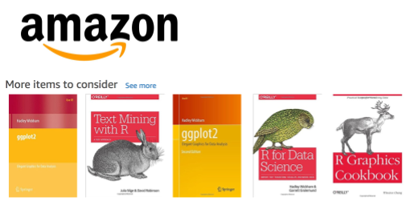
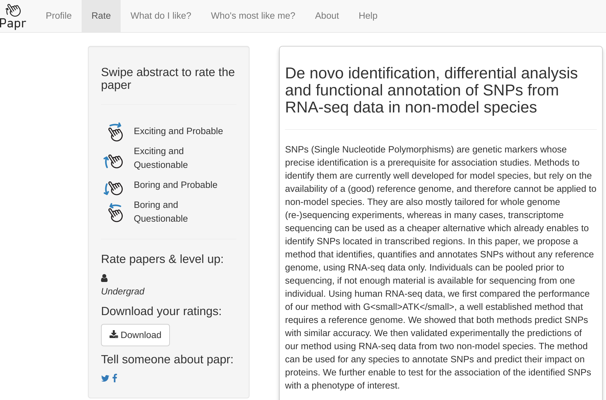
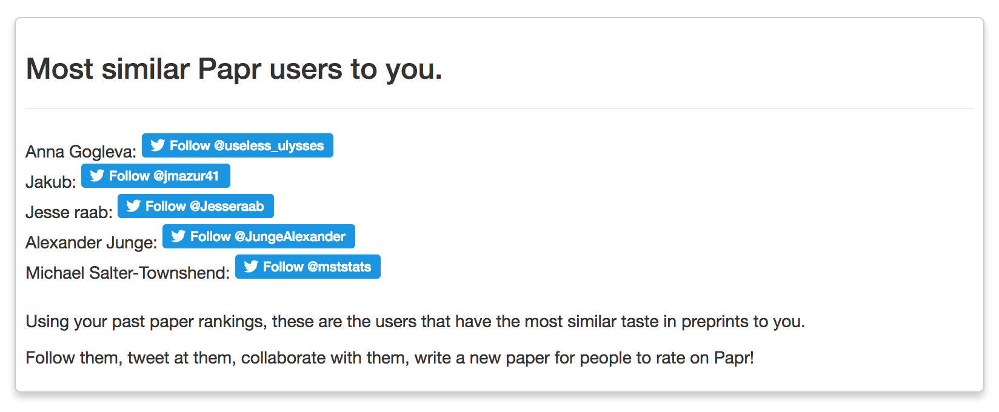

class: center, middle

# Sharing Data Used to be the Problem

---

# Thankfully There was a Solution!

---

# Thankfully There was a Solution?

---

# How to Prevent Researcher Fatigue?

.pull-left[
The competition:

- Plain text is always compatible.
- Plain text is easy to mix and match.
- Plain text is easy to maintain.
- Plain text is lightweight.
- Plain text is always forward compatible.

([Source](https://simplystatistics.org/2017/06/13/the-future-of-education-is-plain-text/))

- There's no sign-up or registration.
]

.pull-right[

**Make everything plain text!**
]

---

# What can we Provide that Plain Text Can't?

--

# We Have the Tools of **Open Science** !

---

# Combined with Recommender Systems

--

# (Meta)Data Products for Open Science

---

# Case Study: Papr

.pull-left[

Lucy D'Agostino McGowan

[@LucyStats](https://twitter.com/LucyStats)

]

.pull-right[

Nick Strayer

[@NicholasStrayer](https://twitter.com/NicholasStrayer)

]

---

([Source](https://simplystatistics.org/2017/06/06/papr-rate-papers-on-biorxiv-in-a-single-swipe-and-help-science/))

---

([Source](https://simplystatistics.org/2017/06/06/papr-rate-papers-on-biorxiv-in-a-single-swipe-and-help-science/))

---

# Researcher Fatigue => Puppy Fatigue

<iframe src="https://giphy.com/embed/R8OuxCDlVc9PO" width="480" height="480" frameBorder="0" class="giphy-embed" allowFullScreen></iframe>

---

# Thank You!

Link to this talk: [seankross.com/iqss-talk](http://seankross.com/iqss-talk)

Code for this talk: [github.com/seankross/iqss-talk](https://github.com/seankross/iqss-talk)

Try out Papr: [jhubiostatistics.shinyapps.io/papr](https://jhubiostatistics.shinyapps.io/papr/)

Find me on Twitter: [@seankross](https://twitter.com/seankross)